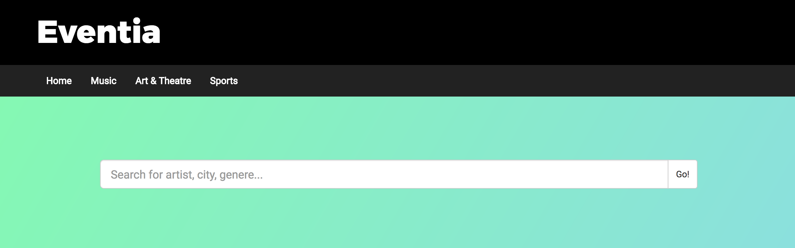
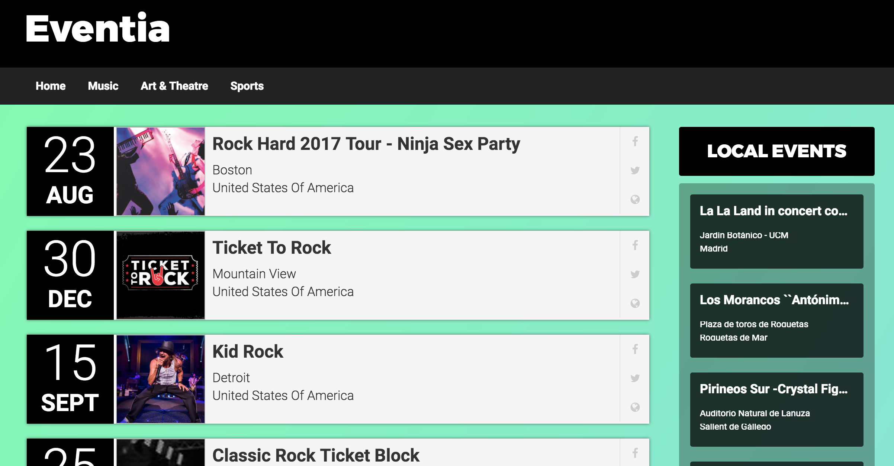
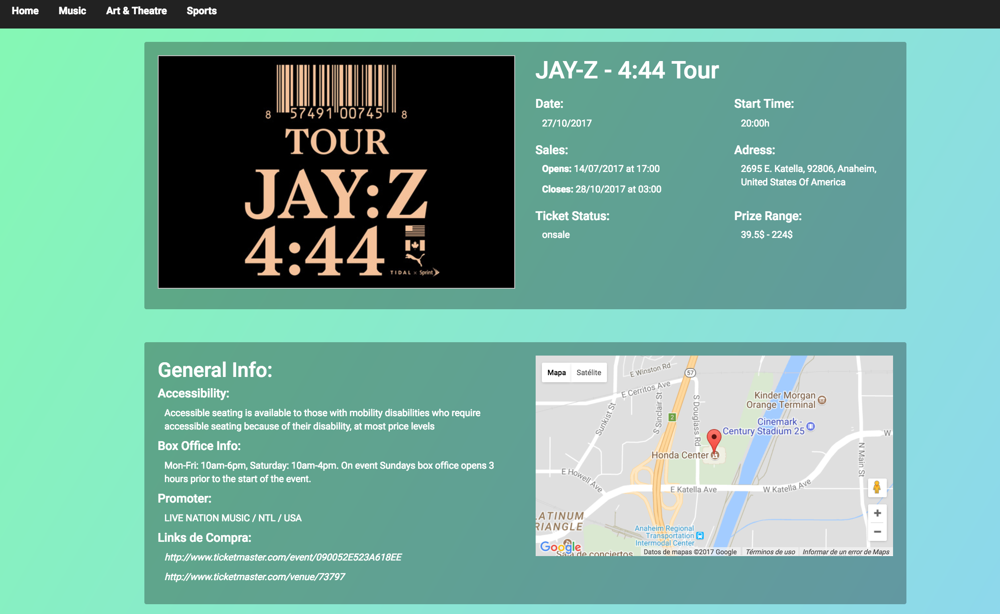

# [EVENTIA](https://jalbertsr.github.io/get-Tikets/#!/)

          
 

Eventia is a helpful web page that let you search for recent, popular or especific events. Events that range from concert, sports, theater, anything! you can even search for Pizza Parties if thats what you desire. Eventia also give imformation about the events such as: prices, location, date and hour, box office information and also bring links to pages where you can buy tickets for the event. Awesome stuff!!

---

### Screenshots 

##### Home screenshot: 

##### Search results screenshot:

##### Card Event Info:

---

### Getting Started

This is a set of directives and services for AngularJS `1.6.3`

### Dependencies

The following dependencies where use to make the Web application

- `AngularJS 1.6.3`

- `AngularJS route 1.6.3`

- `ngMap | AngularJS directives for google maps`

---

### Google Maps API
To run the map from google you need to request an API key in the next link: [Google Maps API](https://developers.google.com/maps/documentation/javascript/get-api-key?hl=#key), then you need to add it into the your index.html file in a script tag.
(Reference line 91 from index.html you add **?key=<%GOOGLE-API%>**, where you need to replace **_<%GOOGLE-API%>_** with your Api-key )

## API
This application relies on external API services for geolocalitzation and events information:

* [Ticket Master](http://developer.ticketmaster.com/products-and-docs/apis/discovery-api/v2/)
* [FreeGeoIp](https://freegeoip.net)

---

## Authors

- [Catalina Buades](https://github.com/catabuades)
- [Humberto Acea](https://github.com/KV-Disco)
- [Joan Albert Segura](https://github.com/jalbertsr)

